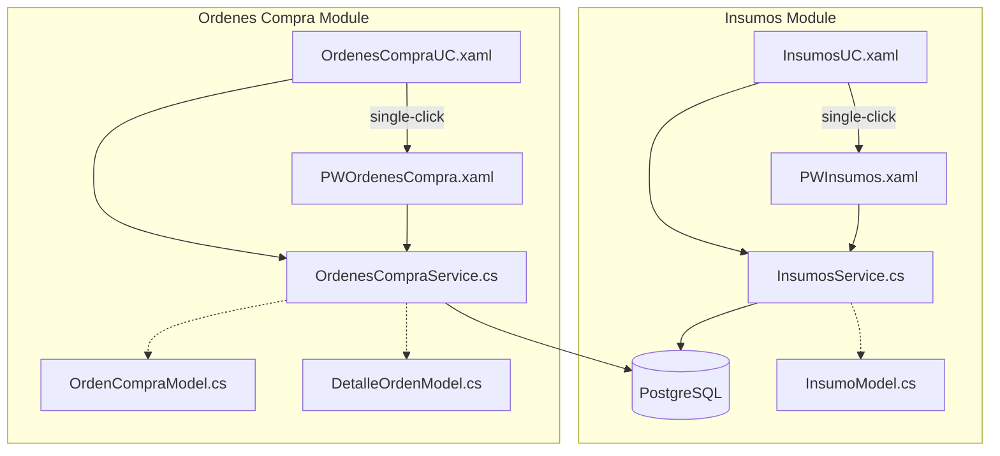

# Insumos & Ordenes de Compra — Implementation Plan

## Overview

Two related modules based on the DB schema:

**Insumos** (standalone inventory items):
- [`insumos`](DB schema): `id`, `nombre`, `descripcion`, `unidad_medida`, `precio_unitario`, `cantidad_stock`

**Ordenes de Compra** (purchase orders with items):
- [`orden_compra`](DB schema): `id`, `fecha`, `hora`, `estado`, `monto`, `proveedor_id` (FK→proveedor)
- [`detalles_orden`](DB schema): `orden_id` (FK→orden_compra), `insumo_id` (FK→insumos), `cantidad`

Both UC's currently have inline CRUD right panels that need to be moved to popup windows (same pattern as Prestamos/Proveedores).

---

## Architecture



---

## Part 1: Insumos Module (7 files)

### 1a. [`Models/InsumoModel.cs`](ProyectoIntegradorNet10/Models/InsumoModel.cs)
- `Id` (int), `Nombre` (string), `Descripcion` (string?), `UnidadMedida` (string?), `PrecioUnitario` (decimal?), `CantidadStock` (decimal?)
- Display property: `PrecioDisplay`, `StockDisplay`

### 1b. [`Services/InsumosService.cs`](ProyectoIntegradorNet10/Services/InsumosService.cs)
- `GetAll()` — `SELECT ... FROM insumos ORDER BY nombre`
- `GetById(int id)` — single insumo
- `Insert(InsumoModel)` — `INSERT ... RETURNING id`
- `Update(InsumoModel)` — `UPDATE insumos SET ...`
- `Delete(int id)` — `DELETE FROM insumos WHERE id = @id`
- `Search(string term)` — `WHERE LOWER(nombre) LIKE @term OR LOWER(descripcion) LIKE @term`

### 1c. [`UserControls/InsumosUC.xaml`](ProyectoIntegradorNet10/UserControls/InsumosUC.xaml) — Rewrite
**Clean layout:** Toolbar + DataGrid only (no right panel)
- Toolbar: Title "Insumos" + Search box + Nuevo/Refrescar buttons (theme styles)
- DataGrid: ID, Nombre, Descripción, Unidad Medida, Precio Unit., Stock
- Cell style includes `Foreground="{DynamicResource NavTextColor}"`

### 1d. [`UserControls/InsumosUC.xaml.cs`](ProyectoIntegradorNet10/UserControls/InsumosUC.xaml.cs) — Rewrite
- `LoadInsumos()` → `InsumosService.GetAll()`
- Debounced search → `InsumosService.Search()`
- Single-click → opens `PWInsumos` with `EditInsumoId`
- Nuevo → opens `PWInsumos` in create mode

### 1e. [`PopWindows/PWInsumos.xaml`](ProyectoIntegradorNet10/PopWindows/PWInsumos.xaml) — New
- Header: icon + title + close button
- Form: Nombre*, Descripción, Unidad Medida, Precio Unitario, Cantidad Stock
- Footer: Guardar / Eliminar (edit mode) / Cancelar
- All theme styles, no local overrides

### 1f. [`PopWindows/PWInsumos.xaml.cs`](ProyectoIntegradorNet10/PopWindows/PWInsumos.xaml.cs) — New
- `EditInsumoId`, `OnDataChanged` event
- Validation: nombre required
- Insert/Update/Delete via `InsumosService`

---

## Part 2: Ordenes de Compra Module (9 files)

### 2a. [`Models/OrdenCompraModel.cs`](ProyectoIntegradorNet10/Models/OrdenCompraModel.cs)
- `Id` (int), `Fecha` (DateTime), `Hora` (TimeSpan), `Estado` (string?), `Monto` (decimal?), `ProveedorId` (int)
- Display helpers: `ProveedorNombre` (string?), `FechaDisplay`, `HoraDisplay`, `MontoDisplay`

### 2b. [`Models/DetalleOrdenModel.cs`](ProyectoIntegradorNet10/Models/DetalleOrdenModel.cs)
- `OrdenId` (int), `InsumoId` (int), `Cantidad` (decimal?)
- Display helpers: `InsumoNombre` (string?), `InsumoPrecio` (decimal?), `SubtotalDisplay`

### 2c. [`Services/OrdenesCompraService.cs`](ProyectoIntegradorNet10/Services/OrdenesCompraService.cs)

| Method | Description |
|--------|-------------|
| `GetAll()` | List all orders with proveedor name, total |
| `GetById(int id)` | Single order + its detalles (joined with insumos) |
| `Insert(OrdenCompraModel, List<DetalleOrdenModel>)` | Transactional: INSERT orden_compra + INSERT detalles_orden |
| `Update(int id, int proveedorId, string estado, List<DetalleOrdenModel>)` | Transactional: DELETE old detalles + UPDATE orden + INSERT new |
| `Delete(int id)` | Transactional: DELETE detalles + DELETE orden |
| `Search(string term)` | Search by ID, proveedor name, estado |

SQL for GetAll:
```sql
SELECT oc.id, oc.fecha, oc.hora, oc.estado, oc.monto, oc.proveedor_id,
       p.nombre AS proveedor_nombre
FROM orden_compra oc
LEFT JOIN proveedor p ON p.id = oc.proveedor_id
ORDER BY oc.fecha DESC, oc.hora DESC
```

### 2d. [`UserControls/OrdenesCompraUC.xaml`](ProyectoIntegradorNet10/UserControls/OrdenesCompraUC.xaml) — Rewrite
**Clean layout:** Toolbar + DataGrid only
- DataGrid columns: ID, Proveedor, Fecha, Hora, Estado, Monto

### 2e. [`UserControls/OrdenesCompraUC.xaml.cs`](ProyectoIntegradorNet10/UserControls/OrdenesCompraUC.xaml.cs) — Rewrite
- Same pattern: Load, debounced search, single-click → popup

### 2f. [`PopWindows/PWOrdenesCompra.xaml`](ProyectoIntegradorNet10/PopWindows/PWOrdenesCompra.xaml) — New

Split layout (like Ventas/Prestamos popup):

```
┌────────────────────────────────────────────────────────────────────┐
│ [📋] Nueva Orden de Compra                       [✕] Close       │
├────────────────────────────────────────────────────────────────────┤
│ ┌────────────── ORDER HEADER ───────────────────────────────────┐ │
│ │ Proveedor [Combo ▼]   Estado [Combo ▼]                       │ │
│ │ Fecha [DatePicker]    Hora [TextBox HH:mm]                   │ │
│ └────────────────────────────────────────────────────────────────┘ │
│                                                                    │
│ ┌────────────── ADD INSUMO ──────────────────────────────────────┐ │
│ │ [Insumo Combo ▼]  [Cantidad]  [＋Agregar]                    │ │
│ ├────────────────────────────────────────────────────────────────┤ │
│ │ Added insumos list:  Insumo | Cant | P.Unit | Subtotal | [✕] │ │
│ │ ...                                                            │ │
│ └────────────────────────────────────────────────────────────────┘ │
│                                                                    │
│ ┌────────────── TOTAL ──────────────────────────────────────────┐ │
│ │ Total: Bs 0.00                                                │ │
│ └────────────────────────────────────────────────────────────────┘ │
│                                                                    │
│ [💾 Guardar]  [🗑 Eliminar]  [Cancelar]                           │
└────────────────────────────────────────────────────────────────────┘
```

### 2g. [`PopWindows/PWOrdenesCompra.xaml.cs`](ProyectoIntegradorNet10/PopWindows/PWOrdenesCompra.xaml.cs)
- `EditOrdenId`, `OnDataChanged`
- Loads proveedores + insumos on init
- Add insumo button → adds row to ObservableCollection
- Remove insumo button → removes row
- Auto-calculates monto = SUM(cantidad × insumo.precio_unitario)
- Save: validates → `Insert()` or `Update()` → `OnDataChanged`
- Delete: confirmation → `Delete()` → `OnDataChanged`

---

## File Changes Summary

| File | Action | Module |
|------|--------|--------|
| `Models/InsumoModel.cs` | **Create** | Insumos |
| `Services/InsumosService.cs` | **Create** | Insumos |
| `UserControls/InsumosUC.xaml` | **Rewrite** | Insumos |
| `UserControls/InsumosUC.xaml.cs` | **Rewrite** | Insumos |
| `PopWindows/PWInsumos.xaml` | **Create** | Insumos |
| `PopWindows/PWInsumos.xaml.cs` | **Create** | Insumos |
| `Models/OrdenCompraModel.cs` | **Create** | Órdenes |
| `Models/DetalleOrdenModel.cs` | **Create** | Órdenes |
| `Services/OrdenesCompraService.cs` | **Create** | Órdenes |
| `UserControls/OrdenesCompraUC.xaml` | **Rewrite** | Órdenes |
| `UserControls/OrdenesCompraUC.xaml.cs` | **Rewrite** | Órdenes |
| `PopWindows/PWOrdenesCompra.xaml` | **Create** | Órdenes |
| `PopWindows/PWOrdenesCompra.xaml.cs` | **Create** | Órdenes |

**No changes needed:**
- `Dashboard.xaml.cs` — Both UCs are already wired
- `Models/InventarioModel.cs` — Separate model for `producto_deposito`, not insumos

---

## Style Conventions (same as Prestamos/Proveedores)
- **No local style overrides** for buttons, combos, datepickers
- Use theme styles: `ActionButton`, `DangerButton`, `SecondaryButton`, `FormComboBox`
- DataGrid cell style: include `Foreground="{DynamicResource NavTextColor}"` + `FontSize="13"`
- DataGrid: include `IsReadOnly="True"`
- Popups: header with icon + close button, `OnDataChanged`, `EditXxxId`, `Window_MouseDown`
- Search TextBoxes use `Style="{x:Null}"` to avoid theme interference (transparent background)

---

## Review

Approve this plan to switch to Code mode and implement both modules.
