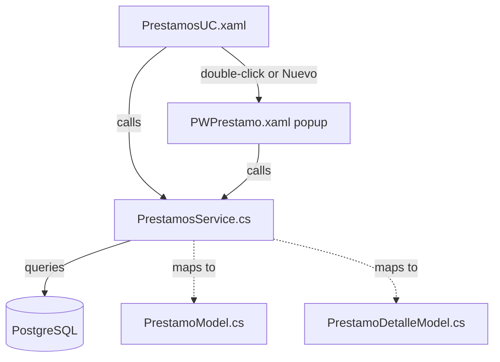
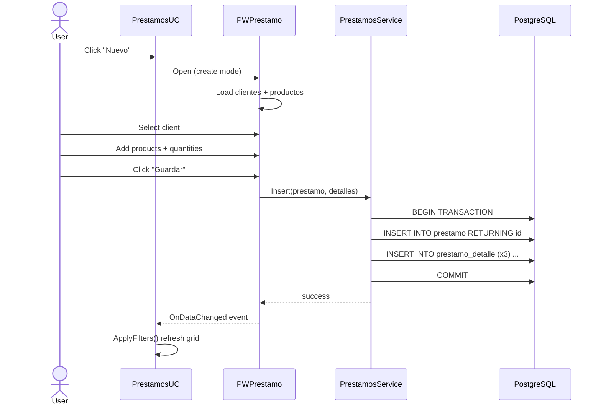
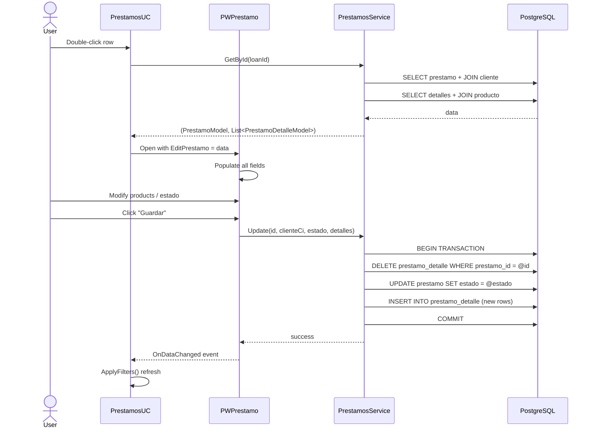

# Prestamos Module Implementation Plan

## Overview
Implement the Prestamos (Loans) module strictly based on the DB schema:
- [`prestamo`](DB schema): `id` (serial PK), `fecha` (timestamp default now), `estado` (varchar)
- [`prestamo_detalle`](DB schema): `cliente_ci` (FK→cliente), `producto_id` (FK→producto), `prestamo_id` (FK→prestamo), `cantidad` (int), `valor_reposicion` (numeric) — composite PK on all 3

**No "Monto" or "Interés" fields.** The `valor_reposicion` = product price × cantidad, stored per detail row.

**UC is just a table** — only the DataGrid lives in the UserControl. All details, editing, creation, and management happens inside the PWPrestamo popup window. Double-click a row to open/view/manage.

---

## Architecture



---

## Step 1: [`ProyectoIntegradorNet10/Models/PrestamoModel.cs`](ProyectoIntegradorNet10/Models/PrestamoModel.cs)

Model for the main loan record.

**Properties:**
- `Id` (int) — maps to `prestamo.id`
- `Fecha` (DateTime) — maps to `prestamo.fecha`
- `Estado` (string?) — maps to `prestamo.estado`
- `ClienteNombre` (string?, computed/joined) — display helper, not in DB
- `ValorTotal` (decimal, computed/joined) — `SUM(valor_reposicion)` across detalles, not in DB
- `FechaDisplay` (string, computed) — `Fecha.ToString("dd/MM/yyyy HH:mm")`

## Step 2: [`ProyectoIntegradorNet10/Models/PrestamoDetalleModel.cs`](ProyectoIntegradorNet10/Models/PrestamoDetalleModel.cs)

Model for each loan detail row (product loaned).

**Properties:**
- `ClienteCi` (string) — maps to `prestamo_detalle.cliente_ci`
- `ProductoId` (int) — maps to `prestamo_detalle.producto_id`
- `PrestamoId` (int) — maps to `prestamo_detalle.prestamo_id`
- `Cantidad` (int?) — maps to `prestamo_detalle.cantidad`
- `ValorReposicion` (decimal?) — maps to `prestamo_detalle.valor_reposicion`
- `ProductoNombre` (string?, display) — joined from `producto.nombre`
- `ProductoPrecio` (decimal?, display) — joined from `producto.precio_venta`
- `SubtotalDisplay` (string, computed) — `(Cantidad * ValorReposicion)?.ToString("N2")`

## Step 3: [`ProyectoIntegradorNet10/Services/PrestamosService.cs`](ProyectoIntegradorNet10/Services/PrestamosService.cs)

Static service class following existing patterns (like [`ClientesService`](ProyectoIntegradorNet10/Services/ClientesService.cs)).

### Methods:

| Method | Description | SQL Pattern |
|--------|-------------|-------------|
| `GetAll()` | List all loans with client name + total | `SELECT p.id, p.fecha, p.estado, c.nombre \|\| ' ' \|\| c.apellido AS cliente_nombre, c.ci AS cliente_ci, COALESCE(SUM(pd.valor_reposicion),0) AS total FROM prestamo p LEFT JOIN prestamo_detalle pd ON pd.prestamo_id = p.id LEFT JOIN cliente c ON c.ci = pd.cliente_ci GROUP BY p.id, c.nombre, c.apellido, c.ci ORDER BY p.fecha DESC` |
| `GetFiltered(string? estado, string? clienteSearch, DateTime? desde, DateTime? hasta)` | Filtered query with smart filters | Dynamically builds WHERE clauses |
| `GetById(int id)` | Single loan + its detalles | Two queries: loan header + detalles with product JOIN |
| `Insert(PrestamoModel, List<PrestamoDetalleModel>)` | Transactional insert | BEGIN; INSERT prestamo RETURNING id; INSERT prestamo_detalle for each; COMMIT |
| `Update(int prestamoId, string clienteCi, string estado, List<PrestamoDetalleModel> detalles)` | Full update | Transaction: DELETE old detalles + UPDATE prestamo + INSERT new detalles |
| `Delete(int id)` | Delete loan + details | BEGIN; DELETE prestamo_detalle WHERE prestamo_id = @id; DELETE prestamo WHERE id = @id; COMMIT |

### Key Design Decisions:
1. **Insert uses a transaction** to ensure atomicity (prestamo + detalles)
2. **GetById returns a tuple** `(PrestamoModel, List<PrestamoDetalleModel>)` — for popup to load full data
3. **GetFiltered dynamically builds WHERE** based on which filters are active — estado combo, client text search, date range. All optional.
4. **Update deletes+reinserts** detalles for simplicity (avoids tracking which rows changed)
5. **NpgsqlDataSource** via `DatabaseConnection.DataSource` — same as all other services

## Step 4 & 5: [`ProyectoIntegradorNet10/UserControls/PrestamosUC.xaml`](ProyectoIntegradorNet10/UserControls/PrestamosUC.xaml) + [`.cs`](ProyectoIntegradorNet10/UserControls/PrestamosUC.xaml.cs)

### Layout (full width DataGrid, no right panel):

```
┌──────────────────────────────────────────────────────────────┐
│ TOOLBAR                                                       │
│ ┌───────────────────────────────────────────────────────────┐ │
│ │ Prestamos                                                 │ │
│ │ [Buscar cliente...]  [Estado: Todos]                      │ │
│ │ [Desde: ____] [Hasta: ____]                               │ │
│ │                                [+ Nuevo]  [Refrescar]     │ │
│ └───────────────────────────────────────────────────────────┘ │
├───────────────────────────────────────────────────────────────┤
│ DataGrid (fills remaining space)                               │
│ ID  | Cliente       | Fecha              | Estado | Total    │
│ 1   | Juan Perez    | 16/06/2026 10:30   | Activo | 75.00    │
│ 2   | Maria Lopez   | 15/06/2026 09:15   | Activo | 120.00   │
│ ...                                                           │
│ Empty state: "No hay prestamos registrados."                  │
└───────────────────────────────────────────────────────────────┘
```

### DataGrid Columns:
- `ID` (width 60) — `{Binding Id}`
- `Cliente` (width *) — `{Binding ClienteNombre}`
- `Fecha` (width 150) — `{Binding FechaDisplay}`
- `Estado` (width 90) — `{Binding Estado}`
- `Valor Total` (width 110) — `{Binding ValorTotal, StringFormat=N2}`

### Filter Controls (in toolbar area):
- **Client search** — TextBox with placeholder text "Buscar por cliente..."
- **Estado filter** — ComboBox: `Todos / Activo / Completado / Cancelado`
- **Date range** — Two DatePickers: "Desde" and "Hasta"
- All filters auto-trigger `ApplyFilters()` on value change

### Code-Behind Logic:

| Method | Description |
|--------|-------------|
| `LoadPrestamos()` | Calls `PrestamosService.GetAll()` → binds to `dgPrestamos` |
| `ApplyFilters()` | Reads all filter values → calls `PrestamosService.GetFiltered()` → rebinds grid |
| `txtClienteSearch_TextChanged` (debounced ~300ms) | Calls `ApplyFilters()` |
| `cmbEstadoFilter_SelectionChanged` | Calls `ApplyFilters()` |
| `dpFechaDesde_SelectedDateChanged` / `dpFechaHasta_SelectedDateChanged` | Calls `ApplyFilters()` |
| `dgPrestamos_SelectionChanged` | On single row selection change → opens `PWPrestamo` popup in edit/view mode with the selected loan |
| `btnNuevo_Click` | Opens `PWPrestamo` popup in create mode |
| `btnRefrescar_Click` | Resets all filters to defaults and reloads |

**Important:** No right detail panel. No edit/delete buttons in the UC. All management is via the popup.

## Step 6 & 7: [`ProyectoIntegradorNet10/PopWindows/PWPrestamo.xaml`](ProyectoIntegradorNet10/PopWindows/PWPrestamo.xaml) + [`.cs`](ProyectoIntegradorNet10/PopWindows/PWPrestamo.xaml.cs)

This popup handles **everything** — viewing details, creating, editing, and deleting loans.

### Popup Layout:

```
+------------------------------------------------------------------+
| [Credit Card] Nuevo Prestamo                    [X] Close        |
| Gestion de prestamos de productos a clientes                     |
+------------------------------------------------------------------+
| +----------------------------------------------------------------+ |
| | LOAN INFO (read-only when editing, editable when creating)      | |
| |                                                                | |
| | Cliente: [ComboBox with search]      *required                 | |
| | Estado:  [ComboBox: Activo/Completado/Cancelado]               | |
| | Fecha:   16/06/2026 10:30  (auto-set, read-only)               | |
| +----------------------------------------------------------------+ |
|                                                                | |
| +----------------------------------------------------------------+ |
| | PRODUCTS SECTION                                                | |
| | Productos Prestados:                                            | |
| | +------------------------------------------------------------+ | |
| | | Producto [Combo] | Cantidad | P.Unitario | V.Reposicion  X | | |
| | |------------------+----------+------------+-----------------| | |
| | | Cerveza X        |    5     |   15.00    |   75.00      [X]| | |
| | | Ron Y            |    2     |   50.00    |  100.00      [X]| | |
| | | ...              |          |            |                 | | |
| | +------------------------------------------------------------+ | |
| | [+ Agregar Producto]                                           | |
| |                                                                | |
| | Total Valor Reposicion: Bs 175.00                              | |
| +----------------------------------------------------------------+ |
|                                                                | |
| +----------------------------------------------------------------+ |
| FOOTER:                                                          | |
|    [Save]  [Delete]  [Cancel]                                   | |
+------------------------------------------------------------------+
```

### Popup Behavior by Mode:

| Mode | Triggered by | Fields | Buttons |
|------|-------------|--------|---------|
| **Create** | `btnNuevo` in UC | Empty client combo, empty products grid, Estado = "Activo", Fecha = now | Save, Cancel |
| **Edit/View** | Double-click row in UC | Pre-filled with loan data, all fields editable | Save, Delete, Cancel |

### XAML Controls:
1. **Client ComboBox** — ItemsSource from `ClientesService.GetAll()`, DisplayMemberPath = `NombreCompleto`, SelectedValuePath = `Ci`. Has search-as-you-type.
2. **Estado ComboBox** — Items: `Activo`, `Completado`, `Cancelado`
3. **Products DataGrid** — Template columns (bound to `ObservableCollection<PrestamoDetalleModel>`):
   - Producto: ComboBox column bound to `ProductosService.GetAll()`, auto-fills P.Unitario on selection
   - Cantidad: TextBox column (numeric only)
   - P.Unitario: ReadOnly TextBlock (auto-filled when product selected)
   - V.Reposicion: ReadOnly TextBlock (auto-calculated = Cantidad × P.Unitario)
   - Remove button: "X" button to delete that row
4. **"Agregar Producto" button** — Adds a new empty `PrestamoDetalleModel` to the collection
5. **Total label** — Computed from collection sum, updates on any change
6. **Footer buttons** — Save (create/update), Delete (only in edit mode), Cancel

### Code-Behind Logic:

| Method | Description |
|--------|-------------|
| `PWPrestamo_Loaded` | Loads client list + product list. If `EditPrestamo` set, populates form |
| `cmbCliente_SelectionChanged` | Stores selected `ClienteCi` |
| `cmbProducto_SelectionChanged` | For that row: auto-fills `PrecioUnitario`, recalculates `ValorReposicion` |
| `txtCantidad_TextChanged` | Recalculates `ValorReposicion` for that row |
| `RecalcularTotal()` | Loops through collection and updates total label |
| `BtnAgregarProducto_Click` | Adds new empty `PrestamoDetalleModel` to collection |
| `BtnQuitarProducto_Click` | Removes selected row from collection |
| `BtnGuardar_Click` | Validates (cliente required, at least 1 product with cantidad > 0) → if creating: `Insert()`, if editing: `Update()` → invokes `OnDataChanged` → closes |
| `BtnEliminar_Click` | (Edit mode only) Confirmation → `PrestamosService.Delete()` → `OnDataChanged` → close |
| `BtnCancelar_Click` | Closes popup |

### Validation Rules:
1. Client must be selected
2. At least one product with Cantidad > 0 must be added
3. Each row must have a product selected

## Data Flow Diagrams

### Create Loan Flow:


### View/Edit Loan Flow:


## File Changes Summary

| File | Action | Description |
|------|--------|-------------|
| `Models/PrestamoModel.cs` | **Create** | Loan model class |
| `Models/PrestamoDetalleModel.cs` | **Create** | Loan detail model class |
| `Services/PrestamosService.cs` | **Create** | CRUD service with GetFiltered |
| `UserControls/PrestamosUC.xaml` | **Rewrite** | Clean design: toolbar + filters + DataGrid only |
| `UserControls/PrestamosUC.xaml.cs` | **Rewrite** | Filter logic, load, double-click opens popup |
| `PopWindows/PWPrestamo.xaml` | **Rewrite** | Full management popup (create/edit/view/delete) |
| `PopWindows/PWPrestamo.xaml.cs` | **Rewrite** | Popup code-behind with all management logic |
| `Windows/Dashboard.xaml.cs` | **No change** | Already wired to `new PrestamosUC()` |

## Style Conventions (CRITICAL)
All XAML must use **theme-aware resources only** — no hardcoded colors, fonts, or dimensions that exist in themes:
- **Backgrounds**: `{DynamicResource FOscuro1}`, `{DynamicResource POscuro2}`, `{DynamicResource InputBgBrush}`, `{DynamicResource BarraBrush}`
- **Text colors**: `{DynamicResource NavTextColor}`, `{DynamicResource SectionLabelColor}`
- **Borders/separators**: `{DynamicResource SeparatorColor}`, `{DynamicResource InputBorderBrush}`
- **Accents**: `{DynamicResource AcentoBrush}`, `{DynamicResource GridRowHoverBrush}`, `{DynamicResource GridRowSelectedBrush}`, `{DynamicResource GridHeaderBrush}`
- **Reuse existing styles**: `FormTextBox`, `FormLabel`, `ActionButton`, `DangerButton`, `SecondaryButton`, `GridStyle`, `TabRadioStyle`
- **ScrollBars/Thumbs**: Use existing `<Style TargetType="ScrollBar">` and `<Style TargetType="Thumb">` from themes or local resources
- **No inline colors**, no `#HEX` values, no hardcoded `FontSize`/`Padding` where styles exist

**C# patterns**: Follow existing conventions — static services, async/await, `NpgsqlDataSource` via `DatabaseConnection.DataSource`, `Map()` + `AddParams()` pattern.

**Models**: Same namespace (`ProyectoIntegradorNet10.Models`), nullable properties with `?` suffix.

**Popups**: Same header/close-button pattern, `OnDataChanged` event, `EditPrestamo` property for edit mode, `Window_MouseDown` for dragging, same `Loaded` lifecycle.

---

## Review & Approval

Review this plan and let me know if you'd like any adjustments before the implementation mode proceeds.
