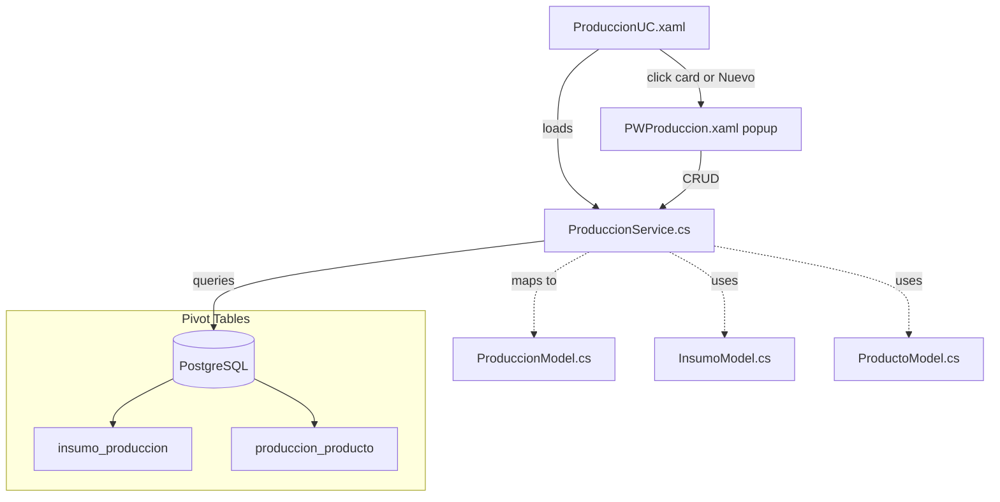
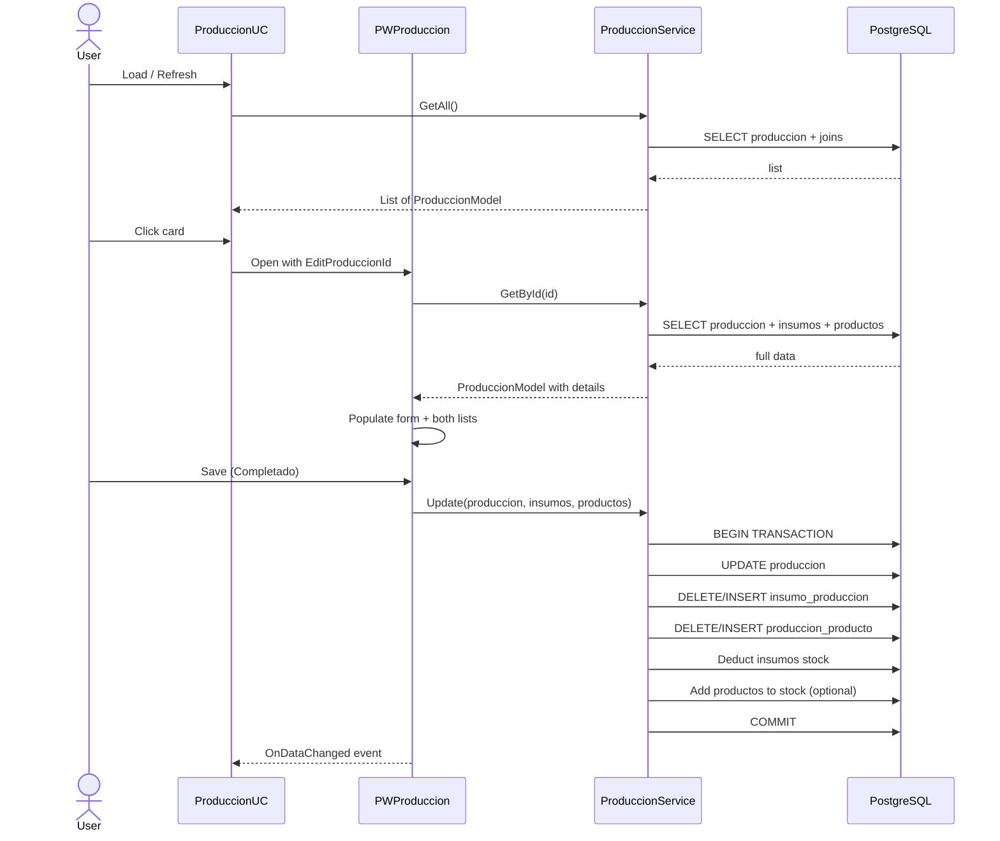

# Producción Module — Implementation Plan

## Overview

Design the full **Producción** (Production) module based on the existing DB schema. A production run tracks:

- When it's scheduled to start, actually started, and ended (`fecha_inicio`, `fecha_fin`)
- Total cost (`costo_total`)
- Status (`estado`: **Planificado** / En proceso / Completado / Cancelado)
- **Insumos consumed** (raw materials) — `insumo_produccion` pivot table
- **Productos manufactured** (finished goods) — `produccion_producto` pivot table

### Status Lifecycle (4 states)

```
Planificado ──→ En proceso ──→ Completado
    │               │               │
    └─── Cancelado ←┘───────────────┘

Stock effects per transition:
- Planificado → En proceso: 🔴 DEDUCT insumos from stock
- En proceso → Completado: 🟢 ADD productos to deposito
- Any → Cancelado: 🟢 REVERSE whatever was deducted/added
- Planificado (no transition): ⚪ No stock effect (pure planning)
```

Key insight: `fecha_inicio` represents the **planned** start date. When the user clicks "Iniciar", the production moves to "En proceso" and stock is deducted at that moment. This decouples planning from execution.

### DB Tables Involved

| Table | Key Columns | Role |
|-------|------------|------|
| `produccion` | id, fecha_inicio, fecha_fin, costo_total, estado | Main production run |
| `insumo_produccion` | produccion_id, insumo_id, cantidad | Insumos consumed (N:M) |
| `produccion_producto` | producto_id, produccion_id, cantidad | Productos produced (N:M) |
| `insumos` | id, nombre, cantidad_stock, precio_unitario, unidad_medida | Referenced raw materials |
| `producto` | id, nombre, precio_venta | Referenced finished products |

### Current State

- [`ProduccionUC.xaml`](ProyectoIntegradorNet10/UserControls/ProduccionUC.xaml) — Skeleton with DataGrid (ID, Fecha Inicio, Fecha Fin, Costo Total, Estado) and a basic right-side form. Uses local style overrides instead of `SharedStyles.xaml`.
- [`ProduccionUC.xaml.cs`](ProyectoIntegradorNet10/UserControls/ProduccionUC.xaml.cs) — Empty (just `InitializeComponent()`).
- No `ProduccionModel.cs`, no `ProduccionService.cs`, no popup window.
- `Dashboard.xaml.cs` already wires `NavProduccion_Click` → new `ProduccionUC()`.

### Design Decision: Cards Layout

The module follows the **OrdenesCompraUC card pattern** instead of DataGrid. Rationale:
1. Production runs have complex detail (many insumos consumed, many productos made) that don't fit cleanly in a flat DataGrid
2. Cards can show status badges, elapsed time, cost, and quick actions per run
3. Consistent UX with existing OrdenesCompra module
4. Clicking a card opens a popup for full detail + editing

---

## Architecture



## Data Flow



---

## Step 1: [`Models/ProduccionModel.cs`](ProyectoIntegradorNet10/Models/ProduccionModel.cs) — Create

```csharp
namespace ProyectoIntegradorNet10.Models
{
    public class ProduccionModel
    {
        public int Id { get; set; }
        public DateTime FechaInicio { get; set; }
        public DateTime? FechaFin { get; set; }
        public decimal? CostoTotal { get; set; }
        public string? Estado { get; set; }   // "En proceso", "Completado", "Cancelado"

        // ── Display helpers ──
        public string FechaInicioDisplay => FechaInicio.ToString("dd/MM/yyyy HH:mm");
        public string FechaFinDisplay => FechaFin?.ToString("dd/MM/yyyy HH:mm") ?? "—";
        public string CostoTotalDisplay => CostoTotal?.ToString("N2") ?? "0.00";

        // ── Detail collections (loaded on demand) ──
        public List<ProduccionInsumoModel> Insumos { get; set; } = new();
        public List<ProduccionProductoModel> Productos { get; set; } = new();
    }

    /// <summary>Row from insumo_produccion pivot table.</summary>
    public class ProduccionInsumoModel
    {
        public int ProduccionId { get; set; }
        public int InsumoId { get; set; }
        public decimal? Cantidad { get; set; }

        // Display helpers
        public string? InsumoNombre { get; set; }
        public decimal? InsumoPrecio { get; set; }
        public string? UnidadMedida { get; set; }
        public decimal Subtotal => (Cantidad ?? 0) * (InsumoPrecio ?? 0);
        public string SubtotalDisplay => Subtotal.ToString("N2");
    }

    /// <summary>Row from produccion_producto pivot table.</summary>
    public class ProduccionProductoModel
    {
        public int ProductoId { get; set; }
        public int ProduccionId { get; set; }
        public decimal? Cantidad { get; set; }

        // Display helpers
        public string? ProductoNombre { get; set; }
        public decimal? PrecioVenta { get; set; }
    }
}
```

---

## Step 2: [`Services/ProduccionService.cs`](ProyectoIntegradorNet10/Services/ProduccionService.cs) — Create

### Methods

| Method | Description | SQL Strategy |
|--------|-------------|-------------|
| `GetAll()` | List all production runs | `SELECT p.* FROM produccion p ORDER BY p.fecha_inicio DESC` |
| `GetById(int id)` | One run + its insumos + its productos | 3 queries: produccion, insumo_produccion JOIN insumos, produccion_producto JOIN producto |
| `Insert(ProduccionModel, List<ProduccionInsumoModel>, List<ProduccionProductoModel>)` | Create + deduct insumos immediately | Transaction: INSERT produccion + INSERT insumo_produccion rows + INSERT produccion_producto rows + DEDUCT insumo stock |
| `Update(ProduccionModel, List<ProduccionInsumoModel>, List<ProduccionProductoModel>)` | Update + sync stock | Transaction: diff insumos (reverse old, apply new) + UPDATE produccion + DELETE/INSERT insumo_produccion + DELETE/INSERT produccion_producto |
| `Delete(int id)` | Delete + reverse all stock effects | Transaction: reverse insumos (if deducted) + reverse productos (if completed) + DELETE insumo_produccion + DELETE produccion_producto + DELETE produccion |
| `UpdateEstado(int id, string estado, int? depositoId)` | Quick status change with stock sync | Completo: add productos to deposito, set fecha_fin. Cancelado: reverse insumo deductions. |
| `Search(string term)` | Search by ID or date | `WHERE CAST(p.id AS TEXT) LIKE @term` |
| `GetFiltered(string? estado, DateTime? desde, DateTime? hasta)` | Filtered list | Dynamic WHERE clauses |

### Stock Synchronization: Three-Phase Lifecycle with Planning

The production module touches TWO separate stock tables. The key insight is that **Planificado** is a pure scheduling state — no stock is affected until the user explicitly starts the production.

```
Planificado ──→ En proceso ──→ Completado
    │               │               │
    └─── Cancelado ←┘───────────────┘

Stock effects:
- Planificado:      ⚪ NONE (pure planning)
- En proceso:       🔴 DEDUCT insumos from insumos.cantidad_stock
- Completado:       🟢 ADD productos to producto_deposito
- Cancelado ← Plan:   ⚪ NONE (nothing was deducted)
- Cancelado ← Proc:   🟢 REVERSE insumo deductions
- Cancelado ← Comp:   🟢 REVERSE insumos + productos
```

#### Phase 0 — On CREATE (always "Planificado")

No stock impact. Pure record creation:
1. `INSERT INTO produccion` with `estado = 'Planificado'` → get new ID
2. `INSERT INTO insumo_produccion` for each insumo row (documentation only)
3. `INSERT INTO produccion_producto` for each producto row (documentation only)

No stock validation needed. The user can freely edit insumos, productos, and dates while in Planificado.

#### Phase 1 — On INICIAR (estado → "En proceso")

Called via `UpdateEstado(id, "En proceso")` — this is the moment stock is affected:
1. Validate stock: check `insumos.cantidad_stock >= requested` for every insumo. If any fails, abort with error listing insufficient items.
2. `UPDATE produccion SET estado = 'En proceso' WHERE id = @id`
3. **DEDUCT insumos**: For each row, `UPDATE insumos SET cantidad_stock = COALESCE(cantidad_stock, 0) - @cantidad WHERE id = @insumoId`

After this, insumos/productos lists become READ-ONLY (production is running).

#### Phase 2 — On COMPLETAR (estado → "Completado")

Called via `UpdateEstado(id, "Completado", depositoId)`:
1. `UPDATE produccion SET estado = 'Completado', fecha_fin = NOW() WHERE id = @id`
2. Recalculate `costo_total` from current insumo costs
3. **ADD productos to deposito**: For each row, call `InventarioService.AddStock(productoId, depositoId, cantidad)`

The `depositoId` is chosen by the user in the UI at completar time.

#### Phase 3 — On CANCELAR (any estado → "Cancelado")

Called via `UpdateEstado(id, "Cancelado")`:
1. `UPDATE produccion SET estado = 'Cancelado', fecha_fin = NOW() WHERE id = @id`
2. If previous estado was "En proceso": REVERSE insumo deductions
3. If previous estado was "Completado": REVERSE insumos AND productos

#### Phase 4 — On UPDATE (while "Planificado")

While Planificado, editing is free — no stock sync needed:
1. `DELETE FROM insumo_produccion WHERE produccion_id = @id` → re-insert new rows
2. `DELETE FROM produccion_producto WHERE produccion_id = @id` → re-insert new rows
3. `UPDATE produccion` set header fields (fecha_inicio, costo_total, etc.)

Once estado ≠ "Planificado", insumos/productos are LOCKED (read-only). Only estado transitions are allowed.

#### Phase 5 — On DELETE

1. If estado was "En proceso": REVERSE insumo deductions
2. If estado was "Completado": REVERSE insumos + productos
3. If estado was "Planificado": just delete (no stock effects)
4. `DELETE FROM insumo_produccion`, `DELETE FROM produccion_producto`, `DELETE FROM produccion`

### Existing Services Used by ProduccionService

| Service | Method Used | Purpose |
|---------|------------|---------|
| `InsumosService` | `AddStock(int id, decimal cantidad)` | Reverse insumo deductions on cancel/delete |
| `InventarioService` | `AddStock(int productoId, int depositoId, decimal cantidad)` | Add productos to deposito on completar |
| `InventarioService` | `RemoveStock(int productoId, int depositoId, decimal cantidad)` | Reverse producto stock on delete after completado |

**Note:** For deducting insumos, `ProduccionService` writes its own SQL directly (`UPDATE insumos SET cantidad_stock = cantidad_stock - @cantidad`) because `InsumosService.AddStock` only adds (no subtract method). For safety, the raw SQL includes `WHERE cantidad_stock >= @cantidad` as a guard clause.

### Validation Rules

| Rule | When | Error Message |
|------|------|---------------|
| Stock insuficiente | CREATE or UPDATE add insumo | "Stock insuficiente de [insumo]: solicitado X, disponible Y" |
| Sin insumos | CREATE | Warning only (allow producing from nothing) |
| Sin productos | CREATE | Warning only (allow tracking insumos only) |
| Fecha inicio vacía | CREATE/UPDATE | "La fecha de inicio es obligatoria" |

### Connection Pattern

```csharp
private static NpgsqlDataSource DS => DatabaseConnection.DataSource;
// All methods use: using var conn = await DS.OpenConnectionAsync();
// Stock-affecting methods use: using var tx = await conn.BeginTransactionAsync();
```

## Step 3: [`UserControls/ProduccionUC.xaml`](ProyectoIntegradorNet10/UserControls/ProduccionUC.xaml) — Rewrite

### Layout (Cards + toolbar, matching OrdenesCompraUC):

```
┌──────────────────────────────────────────────────────────────────┐
│ TOOLBAR (rounded border, POscuro2 background)                      │
│ ┌──────────────────────────────────────────────────────────────┐ │
│ │ Producción  [🔍 Buscar...]  [＋Nuevo] [⟳ Refrescar]        │ │
│ ├──────────────────────────────────────────────────────────────┤ │
│ │ Filters: [Estado: Todos ▼] [Desde: 📅] [Hasta: 📅]         │ │
│ └──────────────────────────────────────────────────────────────┘ │
├──────────────────────────────────────────────────────────────────┤
│ CARD GRID (WrapPanel, scrollable)                                  │
│ ┌──────────┐ ┌──────────┐ ┌──────────┐ ┌──────────┐            │
│ │ #1        │ │ #2        │ │ #3        │ │ #4        │            │
│ │ En proceso│ │ Completado│ │ En proceso│ │ Cancelado │            │
│ │ Bs 450.00 │ │ Bs 320.00 │ │ Bs 890.00 │ │ Bs 0.00   │            │
│ │ 15/06/26  │ │ 14/06/26  │ │ 16/06/26  │ │ 13/06/26  │            │
│ │           │ │           │ │           │ │           │            │
│ │ [✅][❌]  │ │           │ │ [✅][❌]  │ │           │            │
│ └──────────┘ └──────────┘ └──────────┘ └──────────┘            │
│                                                                    │
│ Empty state: "No hay registros de producción."                     │
└──────────────────────────────────────────────────────────────────┘
```

### Card Design

Each card shows:
- **Color-coded top bar**: Planificado=#3498DB (blue), En proceso=#F39C12 (amber), Completado=#27AE60 (green), Cancelado=#E74C3C (red)
- **ID + Status badge** (pill, same color as bar)
- **Fecha inicio** (dd/MM/yyyy HH:mm) — planned start date
- **Fecha fin** (or "—" if not completed)
- **Costo total** (Bs X.XX)
- **Quick action buttons** (context-sensitive):
  - **Planificado**: [✅ Iniciar] [❌ Cancelar] — full edit access
  - **En proceso**: [✅ Completar] [❌ Cancelar] — read-only insumos/productos
  - **Completado**: no quick actions
  - **Cancelado**: no quick actions

### Styles
- **No local style overrides**. Use `SharedStyles.xaml` resources exclusively:
  - `ActionButton`, `DangerButton`, `SecondaryButton`, `OutlineButton`
  - `GridStyle` for any DataGrid usage
- Search bar pattern: transparent bg TextBox + placeholder TextBlock (data-trigger visibility)
- Filter combos and datepickers use theme defaults

---

## Step 4: [`UserControls/ProduccionUC.xaml.cs`](ProyectoIntegradorNet10/UserControls/ProduccionUC.xaml.cs) — Rewrite

| Method | Behavior |
|--------|----------|
| `ProduccionUC_Loaded` | Unsubscribe self, call `LoadProducciones()` |
| `LoadProducciones()` | Calls `ProduccionService.GetAll()` or `GetFiltered()` if filters active |
| `ApplyFilters()` | Reads cmbEstadoFilter, dpDesde, dpHasta → calls `GetFiltered()` |
| `TxtBuscar_TextChanged` | Debounced (300ms) → calls `ProduccionService.Search()` or re-applies filters |
| `CmbEstadoFilter_SelectionChanged` | Re-applies filters |
| `DpFilter_SelectedDateChanged` | Re-applies filters |
| `CardProduccion_Click` | Opens `PWProduccion` with `EditProduccionId` |
| `BtnQuickCompletar_Click` | Confirmation → `UpdateEstado(id, "Completado")` → stock sync → refresh |
| `BtnQuickCancelar_Click` | Confirmation → `UpdateEstado(id, "Cancelado")` → refresh |
| `BtnNuevo_Click` | Opens `PWProduccion` in create mode |
| `BtnRefrescar_Click` | Clear all filters/search → `LoadProducciones()` |

---

## Step 5: [`PopWindows/PWProduccion.xaml`](ProyectoIntegradorNet10/PopWindows/PWProduccion.xaml) — Create

### Popup Layout

```
┌──────────────────────────────────────────────────────────────────────┐
│ [🏭] Nueva Producción / Editar Producción #X         [✕] Close     │
│ Registrar proceso productivo                                         │
├──────────────────────────────────────────────────────────────────────┤
│ ┌────────────── HEADER ────────────────────────────────────────────┐ │
│ │ Fecha Inicio *          Fecha Fin                                │ │
│ │ [DatePicker] [HH:mm]    [DatePicker] [HH:mm]                     │ │
│ │                                                                  │ │
│ │ Estado                  Costo Total                              │ │
│ │ [Combo ▼]               [TextBox Bs 0.00] (auto-calc + manual)  │ │
│ │                                                                  │ │
│ │ Depósito destino * (visible solo si estado = Completado)         │ │
│ │ [Combo de depósitos ▼]   "Donde se almacenarán los productos"    │ │
│ └──────────────────────────────────────────────────────────────────┘ │
│                                                                      │
│ ┌────────────── INSUMOS CONSUMIDOS ────────────────────────────────┐ │
│ │ ⚠️ Al crear: se descontarán del stock inmediatamente             │ │
│ │ [Insumo Combo ▼]  [Cantidad]  [＋Agregar Insumo]                │ │
│ ├──────────────────────────────────────────────────────────────────┤ │
│ │ Insumo          │ Cantidad │ Unidad  │ P.Unit │ Subtotal │ [✕]  │ │
│ │ Botellones 5L   │ 10       │ unidad  │ 15.00  │ 150.00   │ [✕]  │ │
│ │ Tapas rosca     │ 50       │ unidad  │ 2.50   │ 125.00   │ [✕]  │ │
│ ├──────────────────────────────────────────────────────────────────┤ │
│ │ Stock disponible: Botellones 5L (45), Tapas rosca (200)          │ │
│ │                                    Total Insumos: Bs 275.00      │ │
│ └──────────────────────────────────────────────────────────────────┘ │
│                                                                      │
│ ┌────────────── PRODUCTOS FABRICADOS ──────────────────────────────┐ │
│ │ ℹ️ Se añadirán al inventario al completar la producción          │ │
│ │ [Producto Combo ▼]  [Cantidad]  [＋Agregar Producto]            │ │
│ ├──────────────────────────────────────────────────────────────────┤ │
│ │ Producto         │ Cantidad │ Precio Venta │ [✕]                │ │
│ │ Agua 5L          │ 20       │ Bs 25.00     │ [✕]                │ │
│ │ Agua 1L          │ 100      │ Bs 8.00      │ [✕]                │ │
│ └──────────────────────────────────────────────────────────────────┘ │
│                                                                      │
│ ┌────────────── FOOTER ────────────────────────────────────────────┐ │
│ │    [💾 Guardar]  [🗑 Eliminar]  [Cancelar]                      │ │
│ └──────────────────────────────────────────────────────────────────┘ │
└──────────────────────────────────────────────────────────────────────┘
```

### Form Details

1. **Header** — Dynamic title: "Nueva Producción" (create) or "Editar Producción #X" (edit)
2. **Date/Time inputs** — `DatePicker` + `TextBox` (HH:mm) for both inicio and fin
3. **Estado ComboBox** — Items: "En proceso", "Completado", "Cancelado"
4. **Costo Total** — Editable TextBox, also auto-calculated as SUM(insumo subtotals) + optional manual override
5. **Depósito destino** — ComboBox loaded with `DepositosService.GetAll()`. Defaults to first deposito ("Planta"). **Only visible/required when estado = "Completado"**. This determines where finished products are stored in `producto_deposito`.
6. **Insumos section** — ComboBox of all active insumos + quantity TextBox + "Agregar" button. Shows stock available per insumo below the list. **Warning note**: stock will be deducted on save. Subtotal auto-calculated.
7. **Productos section** — ComboBox of all active productos + quantity TextBox + "Agregar" button. **Info note**: productos are added to inventory only on completar. List shows all added with remove button per row.

### Rules by Estado

| Estado | Ins. Stock | Prod. Stock | Depósito Selector | Ins./Prod. Editable | Quick Actions on Card |
|--------|-----------|-------------|--------------------|---------------------|----------------------|
| **Planificado** (default) | ⚪ None | ⚪ None | Hidden | ✅ Full edit | Iniciar, Cancelar |
| **En proceso** | 🔴 Deducted at start | ⚪ None yet | Hidden | 🔒 Read-only | Completar, Cancelar |
| **Completado** | ✅ Already deducted | 🟢 Added to deposito | Visible (locked after save) | 🔒 Read-only | None |
| **Cancelado** | 🟢 Reversed if was En proc. | 🔴 Reversed if was Comp. | Hidden | 🔒 Read-only | None |

**Key UX rule**: The only time insumos can be added/removed/edited is when estado = "Planificado". Once production starts (En proceso), the insumo list is locked because stock has already been deducted.

### All styles from SharedStyles.xaml (NO local overrides)
- Buttons: `ActionButton`, `DangerButton`, `SecondaryButton`
- Inputs: `FormTextBox`, `FormComboBox`, `FormLabel`
- DataGrid inside insumos/productos lists uses `GridStyle`

---

## Step 6: [`PopWindows/PWProduccion.xaml.cs`](ProyectoIntegradorNet10/PopWindows/PWProduccion.xaml.cs) — Create

### Properties
- `int EditProduccionId` — If > 0, opens in edit mode
- `event Action? OnDataChanged` — Fires after save/delete

### Internal State
- `ObservableCollection<ProduccionInsumoModel> _insumos` — Bound to insumos list
- `ObservableCollection<ProduccionProductoModel> _productos` — Bound to productos list
- `List<InsumoModel> _allInsumos` — For the insumo combo
- `List<ProductoModel> _allProductos` — For the producto combo

### Methods

| Method | Behavior |
|--------|----------|
| `PWProduccion_Loaded` | Load insumos (`InsumosService.GetAll`), load productos (`ProductosService.GetAll`), load depositos (`DepositosService.GetAll`). If `EditProduccionId > 0`, load via `ProduccionService.GetById()` and populate all fields + both collections + set estado/read-only mode. |
| `BtnAgregarInsumo_Click` | Validate insumo selected + cantidad > 0. Add to `_insumos`. Update costo total auto-calc. Clear selection. Show stock warning if cantidad > stock disponible. |
| `BtnAgregarProducto_Click` | Validate producto selected + cantidad > 0. Add to `_productos`. Clear selection. |
| `RemoveInsumo_Click` | Remove from `_insumos`. Update costo total. |
| `RemoveProducto_Click` | Remove from `_productos`. |
| `UpdateCostoTotal` | SUM(insumo.cantidad × insumo.precio_unitario). Display as read-only if auto-calc, or allow manual override via checkbox "Costo manual". |
| `Estado_SelectionChanged` | Toggle deposito selector visibility (visible only if "Completado"). Toggle insumo/producto editability (editable only if "Planificado"). |
| `BtnGuardar_Click` | Validate: fecha_inicio required. If create: `Insert()` with estado=Planificado (NO stock effects). If edit and estado=Planificado: `Update()` header + insumos + productos (NO stock effects). If edit and estado≠Planificado: only header updates (insumos/productos locked). Fire `OnDataChanged`. Close. |
| `BtnEliminar_Click` | Confirmation dialog → `Delete()` (reverses stock if En proceso/Completado, just deletes if Planificado) → `OnDataChanged` → Close. |
| `BtnCancelar_Click` | Close window. |
| `Window_MouseDown` | Drag window (LeftButton). |
| `SetReadOnlyMode(bool)` | When estado != "Planificado": disable insumo/producto add/remove, lock cantidad fields. When estado == "Completado": lock deposito. Fecha_inicio always editable. |

### Validation

| Rule | When | Message |
|------|------|---------|
| Fecha inicio vacía | Guardar | "La fecha de inicio es obligatoria" |
| Sin insumos | Guardar (Planificado) | Warning: "No se han agregado insumos. ¿Continuar sin insumos?" |
| Sin productos | Guardar (Planificado) | Warning: "No se han agregado productos. ¿Continuar?" |
| Stock insumo insuficiente | Iniciar (→En proceso) | "Stock insuficiente: [nombre] — disponible: X, solicitado: Y" |
| Depósito no seleccionado | Completar (→Completado) | "Seleccione un depósito destino para los productos" |
| Cantidad ≤ 0 | Agregar insumo/producto | "La cantidad debe ser mayor a 0" |
| Insumo duplicado | Agregar insumo | "Este insumo ya está en la lista" |
| Producto duplicado | Agregar producto | "Este producto ya está en la lista" |

---

## File Changes Summary

| # | File | Action | Description |
|---|------|--------|-------------|
| 1 | `Models/ProduccionModel.cs` | **Create** | Main model + detail models for insumos/productos |
| 2 | `Services/ProduccionService.cs` | **Create** | Full CRUD + filtered queries + stock sync |
| 3 | `UserControls/ProduccionUC.xaml` | **Rewrite** | Cards layout + toolbar + status filters |
| 4 | `UserControls/ProduccionUC.xaml.cs` | **Rewrite** | Card click → popup, quick actions, debounced search |
| 5 | `PopWindows/PWProduccion.xaml` | **Create** | Split form: header + insumos list + productos list |
| 6 | `PopWindows/PWProduccion.xaml.cs` | **Create** | Popup code-behind with full CRUD logic |

### No Changes Needed
- `Dashboard.xaml.cs` — Already wired: `NavProduccion_Click` → `new ProduccionUC()`
- `ProyectoIntegradorNet10.csproj` — No new NuGet dependencies needed
- `App.xaml` — No changes

### Services Referenced (NO changes to these files)
- `InsumosService` — Used to load insumo list for combos, and `AddStock()` for reversals
- `ProductosService` — Used to load producto list for combos
- `DepositosService` — Used to load deposito list for the destino selector
- `InventarioService` — Used via `AddStock()` / `RemoveStock()` for producto_deposito sync
- `DatabaseConnection` — Used for NpgsqlDataSource singleton

---

## Style Conventions (matching all other modules)

- **No local style overrides** in popups or UCs
- Use theme resources: `ActionButton`, `DangerButton`, `SecondaryButton`, `OutlineButton`
- Use theme resources: `FormTextBox`, `FormComboBox`, `FormLabel`, `FormCheckBox`
- DataGrid: `Style="{StaticResource GridStyle}"` (already defined in SharedStyles)
- DataGrid cells: `Foreground="{DynamicResource NavTextColor}"`, `FontSize="13"`
- Popup header: Icon + title + close button, consistent with `PWProveedores`, `PWInsumos`, etc.
- Search TextBox: `Style="{x:Null}"` with transparent bg to avoid theme interference
- Popup window: `WindowStyle="None"`, `AllowsTransparency="True"`, `WindowStartupLocation="CenterOwner"`, `Background="Transparent"`
- `Window_MouseDown` handler for dragging

---

## Review

Approve this plan to switch to **Code mode** and implement the complete Producción module (6 files: 2 new models, 1 new service, 1 rewritten UC, 2 new popup files).
