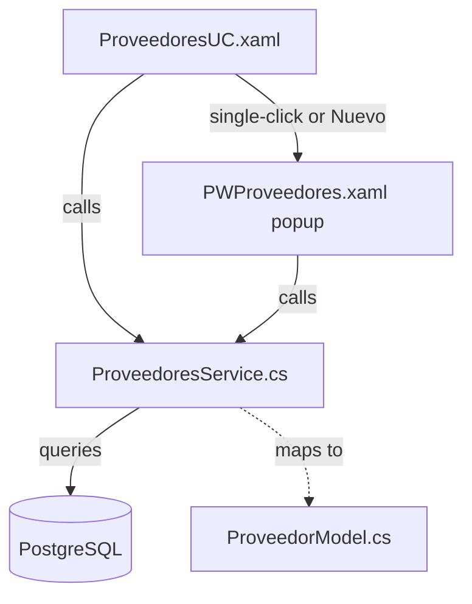
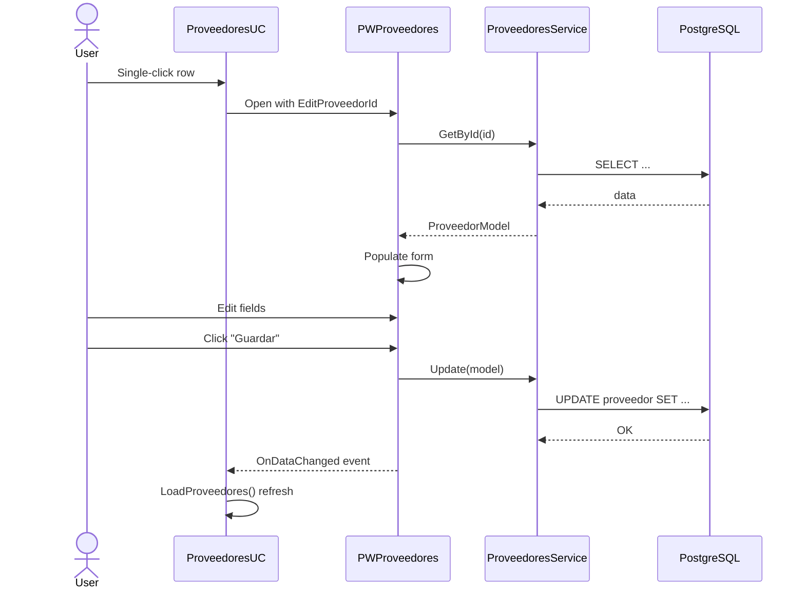

# Proveedores Module Implementation Plan

## Overview
Redesign the Proveedores (Suppliers) module based on the DB schema:
- [`proveedor`](DB schema): `id` (serial PK), `nombre` (varchar NOT NULL), `direccion` (text), `telefono` (varchar)

**Key change**: Move CRUD out of the UC into a popup window. The UC becomes a clean DataGrid + toolbar, and [`PWProveedores`](ProyectoIntegradorNet10/PopWindows/PWProveedores.xaml) handles all create/edit/delete operations.

---

## Architecture



---

## Step 1: [`ProyectoIntegradorNet10/Models/ProveedorModel.cs`](ProyectoIntegradorNet10/Models/ProveedorModel.cs)

Simple model matching the `proveedor` table.

**Properties:**
- `Id` (int) — maps to `proveedor.id`
- `Nombre` (string) — maps to `proveedor.nombre`
- `Direccion` (string?) — maps to `proveedor.direccion`
- `Telefono` (string?) — maps to `proveedor.telefono`

## Step 2: [`ProyectoIntegradorNet10/Services/ProveedoresService.cs`](ProyectoIntegradorNet10/Services/ProveedoresService.cs)

Static service class following same pattern as [`ClientesService`](ProyectoIntegradorNet10/Services/ClientesService.cs).

### Methods:

| Method | Description | SQL |
|--------|-------------|-----|
| `GetAll()` | List all suppliers | `SELECT id, nombre, direccion, telefono FROM proveedor ORDER BY nombre` |
| `GetById(int id)` | Single supplier | `SELECT ... WHERE id = @id` |
| `Insert(ProveedorModel)` | Create new | `INSERT INTO proveedor (nombre, direccion, telefono) VALUES (@nombre, @direccion, @telefono) RETURNING id` |
| `Update(ProveedorModel)` | Update existing | `UPDATE proveedor SET nombre=@nombre, direccion=@direccion, telefono=@telefono WHERE id=@id` |
| `Delete(int id)` | Delete | `DELETE FROM proveedor WHERE id = @id` |
| `Search(string term)` | Search by name/dir/tel | `WHERE LOWER(nombre) LIKE @term OR LOWER(direccion) LIKE @term OR LOWER(telefono) LIKE @term` |

### Key Details:
- Uses `NpgsqlDataSource` via `DatabaseConnection.DataSource`
- `Map()` and `AddParams()` helper methods following exact pattern from ClientesService
- `Search` searches by nombre, direccion, and telefono

## Step 3 & 4: [`ProyectoIntegradorNet10/UserControls/ProveedoresUC.xaml`](ProyectoIntegradorNet10/UserControls/ProveedoresUC.xaml) + [`.cs`](ProyectoIntegradorNet10/UserControls/ProveedoresUC.xaml.cs)

### Layout (DataGrid only — no right panel):

```
┌────────────────────────────────────────────────────────────────┐
│ TOOLBAR                                                         │
│ ┌────────────────────────────────────────────────────────────┐ │
│ │ Proveedores  [🔍 Buscar proveedor...]  [＋Nuevo] [⟳ Refrescar] │ │
│ └────────────────────────────────────────────────────────────┘ │
├────────────────────────────────────────────────────────────────┤
│ DataGrid (full width)                                           │
│ ID  | Nombre          | Dirección         | Teléfono           │
│ 1   | Distribuidora X | Av. Principal 123 | 123-456789         │
│ 2   | Importadora Y   | Calle 2 #45       | 987-654321         │
│ ...                                                             │
│ Empty state: "No hay proveedores registrados."                  │
└────────────────────────────────────────────────────────────────┘
```

### DataGrid Columns:
- `ID` (width 60) — `{Binding Id}`
- `Nombre` (width *) — `{Binding Nombre}`
- `Dirección` (width *) — `{Binding Direccion}`
- `Teléfono` (width 130) — `{Binding Telefono}`

### Code-Behind:

| Method | Description |
|--------|-------------|
| `LoadProveedores()` | Calls `ProveedoresService.GetAll()` → binds to `dgProveedores` |
| `TxtBuscar_TextChanged` (debounced ~300ms) | Calls `ProveedoresService.Search()` or `GetAll()` if empty |
| `DgProveedores_SelectionChanged` | Single-click opens `PWProveedores` in edit mode |
| `BtnNuevo_Click` | Opens `PWProveedores` in create mode |
| `BtnRefrescar_Click` | Reloads list, clears search |

**Important:** No right detail panel. No inline CRUD forms. All management is via the popup.

### XAML Style Rules:
- **No local style overrides** — Use theme styles: `ActionButton`, `DangerButton`, `SecondaryButton` from `SharedStyles.xaml`
- **DataGrid** uses existing `GridStyle` pattern (`Foreground="{DynamicResource NavTextColor}"` on both row and cell styles)
- **Search box** uses transparent background + placeholder text pattern (same as PrestamosUC)
- No `FilterCombo` or `FilterDate` local styles — DatePickers/Combos use theme defaults

## Step 5 & 6: [`ProyectoIntegradorNet10/PopWindows/PWProveedores.xaml`](ProyectoIntegradorNet10/PopWindows/PWProveedores.xaml) + [`.cs`](ProyectoIntegradorNet10/PopWindows/PWProveedores.xaml.cs)

### Popup Layout:

```
┌───────────────────────────────────────────────────────────────┐
│ [🏢] Nuevo Proveedor                     [✕] Close          │
│ Gestión de proveedores                                        │
├───────────────────────────────────────────────────────────────┤
│ ┌───────────────────────────────────────────────────────────┐ │
│ │                                                           │ │
│ │  Nombre *                                                  │ │
│ │  [________________________]                                │ │
│ │                                                           │ │
│ │  Dirección                                                 │ │
│ │  [________________________]                                │ │
│ │                                                           │ │
│ │  Teléfono                                                  │ │
│ │  [________________________]                                │ │
│ │                                                           │ │
│ └───────────────────────────────────────────────────────────┘ │
│                                                               │
│ ┌───────────────────────────────────────────────────────────┐ │
│ │    [💾 Guardar]  [🗑 Eliminar]  [Cancelar]               │ │
│ └───────────────────────────────────────────────────────────┘ │
└───────────────────────────────────────────────────────────────┘
```

### XAML Controls:
1. **Header** — Icon + title ("Nuevo Proveedor" / "Editar Proveedor") + close button
2. **Form fields** (inside a ScrollViewer for small screens):
   - `txtNombre` — TextBox, required validation
   - `txtDireccion` — TextBox with TextWrapping for multi-line
   - `txtTelefono` — TextBox
3. **Footer buttons**:
   - `btnGuardar` — Save/Create, `Style="{StaticResource ActionButton}"`
   - `btnEliminar` — Delete (visible only in edit mode), `Style="{StaticResource DangerButton}"`
   - `btnCancelar` — Close, `Style="{StaticResource SecondaryButton}"`

### Code-Behind:

| Method | Description |
|--------|-------------|
| `PWProveedores_Loaded` | If `EditProveedorId > 0`, loads data via `GetById()` and populates form |
| `BtnGuardar_Click` | Validates (nombre required) → `Insert()` or `Update()` → `OnDataChanged` → close |
| `BtnEliminar_Click` | Confirmation → `Delete()` → `OnDataChanged` → close |
| `BtnCancelar_Click` | Close window |
| `Window_MouseDown` | Drag window |

### Public Properties:
- `event Action? OnDataChanged` — Refresh parent on save/delete
- `int EditProveedorId` — If > 0, opens in edit mode

### Validation:
- Nombre is required (mandatory per DB schema)
- At least show warning if empty

## Data Flow



## File Changes Summary

| File | Action | Description |
|------|--------|-------------|
| `Models/ProveedorModel.cs` | **Create** | Supplier model |
| `Services/ProveedoresService.cs` | **Create** | CRUD service |
| `UserControls/ProveedoresUC.xaml` | **Rewrite** | Clean DataGrid + toolbar, no right panel |
| `UserControls/ProveedoresUC.xaml.cs` | **Rewrite** | Load, search, single-click opens popup |
| `PopWindows/PWProveedores.xaml` | **Rewrite** | Full CRUD popup |
| `PopWindows/PWProveedores.xaml.cs` | **Rewrite** | Popup code-behind |
| `Windows/Dashboard.xaml.cs` | **No change** | Already wired |

## Style Conventions
- **Use theme styles only**: `ActionButton`, `DangerButton`, `SecondaryButton`, `FormComboBox` from `SharedStyles.xaml`
- **No local style overrides** for buttons, combos, or datepickers
- **DataGrid** cell style must include `Foreground="{DynamicResource NavTextColor}"` for dark mode compatibility
- **No hardcoded colors** — all via `{DynamicResource ...}`
- Popup follows existing pattern: `OnDataChanged`, `EditProveedorId`, header with close button, `Window_MouseDown`

---

## Review

Review this plan and approve it for implementation.
