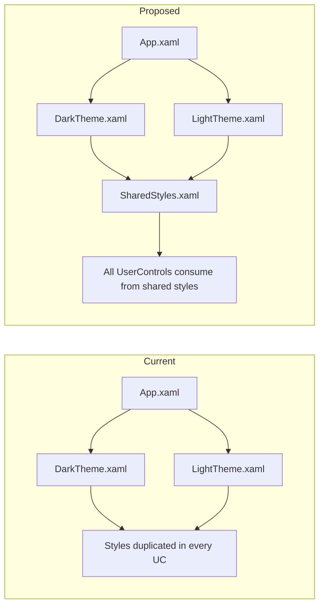
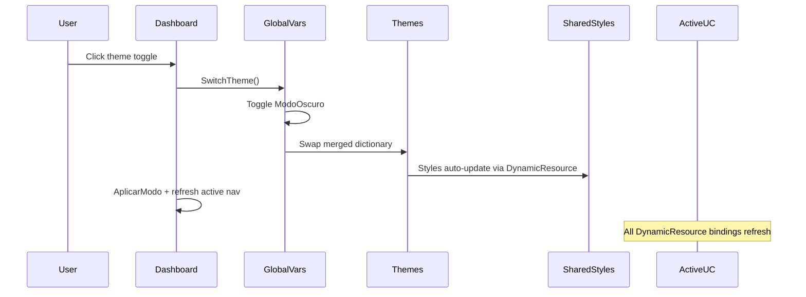

# UI Polish Plan — Dashboard & UserControls

> **Context:** WPF .NET 10 application (BajoCero / AguaPotable Pro management system)
> **Scope:** Visual refinement only — no new features, no logic changes
> **Targets:** Dashboard shell, Themes (dark/light), all UserControls, PopWindows

---

## 1. PROBLEMS IDENTIFIED

### 1.1 Massive Style Duplication
Every `UserControl` redefines the same styles locally:
- `ActionButton`, `SecondaryButton`, `DangerButton` — duplicated in 10+ UCs
- `DataGrid` (GridStyle), `DataGridColumnHeader`, `DataGridRow`, `DataGridCell` — duplicated in 8+ UCs
- `ScrollBar` / `Thumb` — duplicated everywhere
- `FormTextBox`, `FormComboBox`, `FormLabel`, `FormCheckBox` — duplicated in VentasUC, PWEmployees, etc.

**This is the #1 source of visual inconsistency.** Different UCs use slightly different values (e.g., `RowHeight="48"` vs `"42"` vs `"44"` vs `"52"`; `Padding="12,0"` vs `"10,0"` vs `"14,0"`).

### 1.2 Navigation UX is Basic
- Hand-drawn Canvas icons are visually inconsistent (different stroke widths, alignments, sizes)
- No active page indicator — `SetActiveNav()` sets a background + left border only, no icon color
- No page title / breadcrumb in the top bar
- Section headers ("PRINCIPAL", "ANALISIS", "ADMINISTRACIÓN") are plain text

### 1.3 Theme Integration is Incomplete
- Hardcoded colors remain (e.g., `#888` for placeholder text in ClientesUC, EmpleadosUC; `#27AE60` / `#C0392B` for status badges)
- Light theme colors feel less refined than dark theme
- Some elements don't respond to theme change properly

### 1.4 Empty & Loading States are Sparse
- Most UCs show a simple centered `TextBlock` with no illustration or helpful CTA
- No loading spinners

### 1.5 Content Switching has No Animation
- Dashboard content swaps instantly via `Contenido.Content = new XXXUC()` — no fade

### 1.6 Form Inputs Lack Visual Polish
- No validation state styling (red border for invalid fields)
- No consistent field spacing or sizing across popups

### 1.7 Popup Windows Lack Consistency
- PopWindows have slightly different form patterns
- No standardized header/footer layout

---

## 2. USER DECISIONS (CONFIRMED)

| Decision | Choice |
|----------|--------|
| Sidebar collapsible? | **No** — keep fixed |
| Icon approach? | **Path geometry** (no NuGet packages) |
| Popup modal approach? | Keep as separate windows, no overlay |
| Animation complexity? | Basic fades + button press effects |
| Design philosophy | Professional WPF native look, not web-like |

---

## 3. IMPLEMENTATION PLAN

### Phase A — Foundation: Theme & Style Consolidation

#### A.1 Create `Themes/SharedStyles.xaml`
Move all duplicated styles into a single shared dictionary loaded by **both** `DarkTheme.xaml` and `LightTheme.xaml`:
- `ActionButton` / `DangerButton` / `SecondaryButton` / `OutlineButton`
- `DataGrid` (GridStyle) with **standardized RowHeight="44"**
- `DataGridColumnHeader` / `DataGridRow` / `DataGridCell`
- `ScrollBar` / `Thumb`
- `FormTextBox` / `FormComboBox` / `FormLabel` / `FormCheckBox`

Standardized values:
- `RowHeight="44"` (consistent across all DataGrids)
- `DataGridColumnHeader Height="38"`, `Padding="12,0"`
- `DataGridCell Padding="12,0"`
- `ActionButton Height="36"`, `CornerRadius="8"`, `Padding="16,8"`
- `ScrollBar Width="6"`

#### A.2 Enhance Theme Color Tokens
Add to both `DarkTheme.xaml` and `LightTheme.xaml`:
- `PlaceholderTextBrush` — replaces hardcoded `#888`
- `SuccessBrush` / `WarningBrush` / `DangerBrush` — semantic action colors
- `SuccessBgBrush` / `WarningBgBrush` / `DangerBgBrush` — soft background variants for badges
- `CardShadow` — standardized `DropShadowEffect`
- `CardHoverShadow` — stronger shadow for hover states

#### A.3 Update Theme Loading
- Both themes merge `SharedStyles.xaml` as a `MergedDictionary`
- `App.xaml` stays the same (loads DarkTheme by default)

### Phase B — Dashboard Shell Redesign

#### B.1 Replace Canvas Icons with Proper Path Geometry
Convert all 16+ nav icons from Canvas-based drawing to clean `Path` `Data` strings:
- Use `StreamGeometry` mini-language for crisp, DPI-independent rendering
- Keep the same visual concepts (box+triangle for Productos, person for Empleados, etc.)
- Standardize icon size to `20x20` viewport
- Icons should change color based on active/hover state (already use `{DynamicResource NavTextColor}`)

#### B.2 Active Nav Indicator Improvement
Current: `SetActiveNav()` sets background + left border only.
Improvement:
- Add a colored accent bar on the left (3px) using `Border.BorderThickness`
- **Icon color shift** — active nav icon gets a brighter/more prominent tint
- Text weight goes from normal to **bold** on active

#### B.3 Top Bar Enhancements
- **Add page title:** Show current section name next to the time (e.g., `Productos  ·  14:30`)
- Update the title in each nav click handler (or via `_activeNavButton` content)
- **Better time format:** Include date + time
- **Theme toggle icon:** Use "🌙" / "☀️" unicode symbol instead of "☀ Modo" text
- Refine window control button styling (minimize/maximize/close)

#### B.4 Content Fade-In Transition
- Add a subtle fade animation when swapping `Contenido.Content`
- Use `ContentControl` with a `Storyboard` targeting `Opacity` from 0 to 1 over 150-200ms

### Phase C — UserControl Visual Refinements

#### C.1 Strip Duplicate Styles from All UCs
For **every** UserControl:
1. Remove all locally-defined styles that now exist in `SharedStyles.xaml`
2. Switch to `Style="{StaticResource SharedStyleName}"` (use `StaticResource` since styles are in merged dictionaries)
3. Keep only UC-specific styles (e.g., `ProductTabControl`, `ProductTabItem` in ProductosUC)

**Files to modify:**
- ProductosUC.xaml, EmpleadosUC.xaml, ClientesUC.xaml, VentasUC.xaml
- VentasPagosUC.xaml, DistribucionUC.xaml, ReportesUC.xaml
- FacturacionUC.xaml, InventarioUC.xaml, InsumosUC.xaml
- ProduccionUC.xaml, ProveedoresUC.xaml, OrdenesCompraUC.xaml
- PrestamosUC.xaml, RolesPermisosUC.xaml, VehiculosUC.xaml
- DepositosUC.xaml, PagosUC.xaml, PedidosUC.xaml, IncidenciasUC.xaml

#### C.2 Fix Hardcoded Colors
Replace all hardcoded color values with `DynamicResource` references:
- `#888` → `{DynamicResource PlaceholderTextBrush}`
- `#27AE60` → `{DynamicResource SuccessBrush}`
- `#C0392B` → `{DynamicResource DangerBrush}`
- `#E74C3C` → `{DynamicResource DangerBrush}`
- `#2ECC71` → `{DynamicResource SuccessBrush}`
- etc.

#### C.3 Standardize DataGrid Row Heights
Set all DataGrid `RowHeight` to **44** (the standardized value in SharedStyles).

#### C.4 Richer Empty States
Replace plain `TextBlock` empty states with a consistent pattern:
```
Border
  StackPanel
    Icon/emoji (large, centered)
    Title (e.g., "No hay productos")
    Description (e.g., "Agregue un producto para comenzar")
```
Use `{DynamicResource SectionLabelColor}` for descriptive text.

#### C.5 Consistent Card Layouts
Standardize product cards in `ProductosUC` and `VentasUC`:
- Card width: consistent (pick one size)
- Info section padding: `12,10,12,12`
- Font sizes: name `14px`, price `13px` bold, stock `12px`

### Phase D — Popup Window Polish

#### D.1 Standardize PopWindow Patterns
All PopWindows should follow:
- **Header:** Title text + close "✕" button (top-right)
- **Body:** Form fields with `FormLabel` + `FormTextBox` / `FormComboBox`
- **Footer:** Save button (`ActionButton`) + Cancel button (`SecondaryButton`)

#### D.2 Add Shared Form Styles
All PopWindows already use `FormTextBox`, `FormLabel` etc. — ensure they all reference the shared versions once created.

#### D.3 Consistent Sizing
Standardize popup sizes:
- Edit/create forms: `Width="520" Height="Auto"` (with `MinHeight`, `MaxHeight`)
- View-only: smaller

### Phase E — Micro-interactions & Final Polish

#### E.1 Button Press Effect
Add to `ActionButton` / `DangerButton` / `SecondaryButton` templates:
- `RenderTransform` with `ScaleTransform` 1.0 → 0.97 on `IsPressed`
- 100ms animation duration

#### E.2 Standardize Nav Hover
- Already has `DropShadowEffect` on hover — standardize to: `ShadowDepth="0" Opacity="0.3" BlurRadius="8"`

#### E.3 Content Fade Transition
- 150ms `DoubleAnimation` on content Opacity when changing pages
- Applied in Dashboard.xaml.cs via `Contenido.BeginAnimation(OpacityProperty, ...)`

---

## 4. COMPLETE TODO LIST (for Code mode)

```
[x] Phase A: Create Themes/SharedStyles.xaml with all consolidated styles
[ ] Phase A: Add new color tokens to DarkTheme.xaml and LightTheme.xaml
[ ] Phase A: Update both themes to merge SharedStyles.xaml
[ ] Phase A: Update App.xaml if needed
[ ] Phase B: Replace Canvas nav icons with clean Path geometry in Dashboard.xaml
[ ] Phase B: Improve active nav indicator (icon color shift, accent bar)
[ ] Phase B: Add page title to top bar + better time display
[ ] Phase B: Refine theme toggle button icon
[ ] Phase B: Add content fade-in transition on page switch
[ ] Phase C: Strip duplicate styles from ProductosUC.xaml
[ ] Phase C: Strip duplicate styles from EmpleadosUC.xaml
[ ] Phase C: Strip duplicate styles from ClientesUC.xaml
[ ] Phase C: Strip duplicate styles from VentasUC.xaml
[ ] Phase C: Strip duplicate styles from VentasPagosUC.xaml
[ ] Phase C: Strip duplicate styles from DistribucionUC.xaml
[ ] Phase C: Strip duplicate styles from ReportesUC.xaml
[ ] Phase C: Strip duplicate styles from remaining UCs
[ ] Phase C: Fix all hardcoded colors → DynamicResource
[ ] Phase C: Standardize DataGrid row heights to 44px
[ ] Phase C: Enhance empty states with icons + descriptions
[ ] Phase C: Standardize card layouts
[ ] Phase D: Standardize PopWindow form patterns (all PWs)
[ ] Phase E: Add button press scale animation to shared styles
[ ] Phase E: Standardize nav hover shadow values
[ ] Phase E: Wire up content fade transition in Dashboard.xaml.cs
```

---

## 5. ARCHITECTURE



## 6. THEME SWITCHING FLOW



---

## 7. KEY METRICS

| Metric | Current | Target |
|--------|---------|--------|
| Duplicate style definitions | ~15+ copies per style | 1 copy in SharedStyles |
| DataGrid row height variants | 42/44/48/52px | 44px (standard) |
| Hardcoded color values | 5+ locations | 0 — all via resources |
| Empty state quality | Plain TextBlock | Icon + title + description |
| Nav transition | Instant | 150ms fade-in |
| Button press feedback | None | Scale 0.97 on press |
