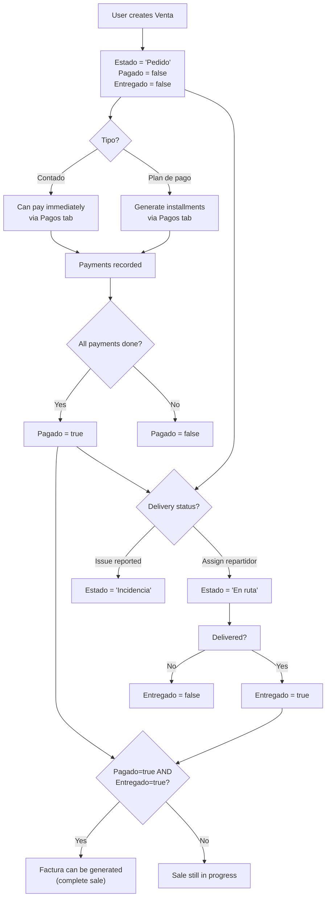

# Plan: Venta/Pago State Migration — Delivery Status, Payment Boolean, Delivery Boolean

## 1. Summary

Currently the [`Estado`](ProyectoIntegradorNet10/Models/VentaModel.cs:12) column in `venta` is overloaded — it tracks **payment status** (`"Pendiente"`, `"Pagado"`, `"Vencido"`). The DB already has `pagado` and `entregado` boolean columns, but they are **not used** in the code.

**New semantics:**

| Column      | Old Meaning                                 | New Meaning                                                   |
| ----------- | ------------------------------------------- | ------------------------------------------------------------- |
| `tipo`      | `'Contado'` / `'Plan de pago'`              | **Unchanged**                                                 |
| `estado`    | Payment status (`Pendiente/Pagado/Vencido`) | **Delivery status** (`'Pedido'`, `'En ruta'`, `'Incidencia'`) |
| `pagado`    | _(not used)_                                | `true` = fully paid, `false` = not yet                        |
| `entregado` | _(not used)_                                | `true` = delivered, `false` = not yet                         |

---

## 2. Current Architecture (Before)

```
VentaModel
├── Tipo (Contado / Plan de pago)
├── Estado (Pendiente / Pagado / Vencido) ← overloaded for payment
└── (no Pagado / Entregado / DireccionEntrega)

VentasService
├── SELECT: estado used as payment status
├── INSERT: default estado = "Pendiente"
└── UPDATE: estado written directly

VentasUC (popup form)
├── BtnGuardar → estado = "Pendiente"
└── PopulateForm → read-only if estado == "Pagado"

PagosUC (payment tab)
├── UpdateVentaEstadoFromPagos → sets estado = "Pagado"/"Vencido"/"Pendiente"
├── BtnMarcarPagado → sets estado = "Pagado"
├── CheckPagoSum → checks estado == "Pagado"
└── btnGenerarFactura → visible only if estado == "Pagado"

VentasPagosUC (main DataGrid)
├── Column "Estado" bound to Estado
└── Filter "Tipo" with ComboBoxItem: Contado / Plan de pago
```

---

## 3. Detailed Change Plan

### Step 1 — Update [`VentaModel.cs`](ProyectoIntegradorNet10/Models/VentaModel.cs)

**Add properties:**

```csharp
public bool Pagado { get; set; }
public bool Entregado { get; set; }
public string? DireccionEntrega { get; set; }
```

**Update `Estado` comment:**

```csharp
public string? Estado { get; set; }  // 'Pedido', 'En ruta', 'Incidencia'
```

**Add display helpers (optional but useful):**

```csharp
public string PagadoDisplay => Pagado ? "✅ Sí" : "❌ No";
public string EntregadoDisplay => Entregado ? "✅ Sí" : "❌ No";
public string EstadoDisplay => Estado ?? "Pedido";
```

**Files to modify:** [`ProyectoIntegradorNet10/Models/VentaModel.cs`](ProyectoIntegradorNet10/Models/VentaModel.cs)

---

### Step 2 — Update [`VentasService.cs`](ProyectoIntegradorNet10/Services/VentasService.cs)

**2a. All SELECT queries** — add `v.pagado`, `v.entregado`, `v.direccion_entrega` to the column list.

**2b. `MapVenta`** — add mapping for the 3 new columns (column indices 10, 11, 12).

**2c. `InsertVenta`** — add parameters for `@pagado`, `@entregado`, `@direccion`.

**2d. `UpdateVenta`** — add `pagado = @pagado, entregado = @entregado, direccion_entrega = @direccion`.

**Files to modify:** [`ProyectoIntegradorNet10/Services/VentasService.cs`](ProyectoIntegradorNet10/Services/VentasService.cs)

---

### Step 3 — Update [`VentasPagosUC.xaml`](ProyectoIntegradorNet10/UserControls/VentasPagosUC.xaml) (Main DataGrid)

**Replace the Estado column and add new columns:**

```xml
<!-- Before -->
<DataGridTextColumn Header="Estado" Binding="{Binding Estado}" Width="80"/>

<!-- After -->
<DataGridTextColumn Header="Estado" Binding="{Binding Estado}" Width="90"/>
<DataGridTemplateColumn Header="Pagado" Width="70">
    <DataGridTemplateColumn.CellTemplate>
        <DataTemplate>
            <TextBlock Text="{Binding PagadoDisplay}" FontSize="12"/>
        </DataTemplate>
    </DataGridTemplateColumn.CellTemplate>
</DataGridTemplateColumn>
<DataGridTemplateColumn Header="Entregado" Width="80">
    <DataGridTemplateColumn.CellTemplate>
        <DataTemplate>
            <TextBlock Text="{Binding EntregadoDisplay}" FontSize="12"/>
        </DataTemplate>
    </DataGridTemplateColumn.CellTemplate>
</DataGridTemplateColumn>
```

**Add Estado filter to the filter bar:**

Add a new ComboBox filter for `Estado` (Pedido / En ruta / Incidencia / Todos) similar to the existing Tipo filter.

**Files to modify:** [`ProyectoIntegradorNet10/UserControls/VentasPagosUC.xaml`](ProyectoIntegradorNet10/UserControls/VentasPagosUC.xaml), [`ProyectoIntegradorNet10/UserControls/VentasPagosUC.xaml.cs`](ProyectoIntegradorNet10/UserControls/VentasPagosUC.xaml.cs)

---

### Step 4 — Update [`VentasUC.xaml.cs`](ProyectoIntegradorNet10/UserControls/VentasUC.xaml.cs) (Popup Form — Create/Edit Venta)

**4a. `BtnGuardar_Click`** — change defaults when creating a new venta:

```csharp
// Before
Estado = "Pendiente",

// After
Estado = "Pedido",       // default delivery status
Pagado = false,
Entregado = false,
```

Also pass `DireccionEntrega` if a field is added in the form.

**4b. `PopulateForm`** — change read-only check:

```csharp
// Before: checks estado == "Pagado"
string estado = venta.Estado ?? "";
_isReadOnly = string.Equals(estado, "Pagado", ...);

// After: checks pagado boolean
_isReadOnly = venta.Pagado;
```

This means once a venta is marked as paid, it becomes read-only regardless of delivery status.

**4c. Add `DireccionEntrega` field** — add a TextBox in the form for the delivery address. This is used in the delivery workflow.

**Files to modify:** [`ProyectoIntegradorNet10/UserControls/VentasUC.xaml.cs`](ProyectoIntegradorNet10/UserControls/VentasUC.xaml.cs), [`ProyectoIntegradorNet10/UserControls/VentasUC.xaml`](ProyectoIntegradorNet10/UserControls/VentasUC.xaml)

---

### Step 5 — Update [`PagosUC.xaml.cs`](ProyectoIntegradorNet10/UserControls/PagosUC.xaml.cs) (Payment Management Tab)

**5a. `UpdateVentaEstadoFromPagos`** — replace `Estado` writes with `Pagado` writes:

```csharp
// Before
if (allPagados) venta.Estado = "Pagado";
else if (anyVencido) venta.Estado = "Vencido";
else venta.Estado = "Pendiente";

// After
if (allPagados) venta.Pagado = true;
else venta.Pagado = false;
```

**5b. `BtnMarcarPagado_Click`** — change to set `Pagado`:

```csharp
// Before
EditVenta.Estado = "Pagado";

// After
EditVenta.Pagado = true;
```

**5c. `CheckPagoSum`** — change check:

```csharp
// Before
if (EditVenta.Estado == "Pagado") { ... }

// After
if (EditVenta.Pagado) { ... }
```

**5d. `LoadPagos`** — update header display and factura visibility:

```csharp
// Before: shows estado
txtPagoVentaTotal.Text = $"Tipo: {venta.Tipo} | Estado: {venta.Estado}";

// After: shows pagado boolean
txtPagoVentaTotal.Text = $"Tipo: {venta.Tipo} | Pagado: {(venta.Pagado ? "Sí" : "No")} | Entregado: {(venta.Entregado ? "Sí" : "No")}";

// Factura visibility
// Before
btnGenerarFactura.Visibility = (venta.Estado == "Pagado") ? Visibility.Visible : Visibility.Collapsed;

// After
btnGenerarFactura.Visibility = venta.Pagado ? Visibility.Visible : Visibility.Collapsed;
```

**Files to modify:** [`ProyectoIntegradorNet10/UserControls/PagosUC.xaml.cs`](ProyectoIntegradorNet10/UserControls/PagosUC.xaml.cs)

---

### Step 6 — Add Estado (Delivery Status) Management in the Popup

The user may want to change the delivery status from the UI. Add a ComboBox in [`VentasUC.xaml`](ProyectoIntegradorNet10/UserControls/VentasUC.xaml) for `Estado` with options:

- `Pedido` (default)
- `En ruta`
- `Incidencia`

This should be editable when the venta is **not** read-only (i.e., when `Pagado == false`).

Optionally, add an "Entregado" checkbox to mark delivery as complete.

**Files to modify:** [`ProyectoIntegradorNet10/UserControls/VentasUC.xaml`](ProyectoIntegradorNet10/UserControls/VentasUC.xaml), [`ProyectoIntegradorNet10/UserControls/VentasUC.xaml.cs`](ProyectoIntegradorNet10/UserControls/VentasUC.xaml.cs)

---

### Step 7 — Optional: Update [`FacturasService.cs`](ProyectoIntegradorNet10/Services/FacturasService.cs)

The `venta_estado` column in `FacturaModel` joins `v.estado`. The query fetches `v.estado` as `VentaEstado`. This is purely informational and will now reflect the **delivery status** rather than payment status. No code change strictly needed, but the semantics shift automatically.

**Files to modify:** None needed (semantic change only).

---

### Step 8 — Optional: SQL Migration Script

If data exists in production, run a migration:

```sql
-- Set pagado = true for all ventas that were previously marked as paid
UPDATE venta SET pagado = true WHERE estado IN ('Pagado');

-- Set default delivery status for all existing ventas
UPDATE venta SET estado = 'Pedido' WHERE estado NOT IN ('Pedido', 'En ruta', 'Incidencia');

-- Optionally add a CHECK constraint
ALTER TABLE venta ADD CONSTRAINT venta_estado_check
  CHECK (estado IN ('Pedido', 'En ruta', 'Incidencia'));
```

---

## 4. Files to Modify (Complete List)

| #   | File                                                                                                                       | Changes                                                                   |
| --- | -------------------------------------------------------------------------------------------------------------------------- | ------------------------------------------------------------------------- |
| 1   | [`ProyectoIntegradorNet10/Models/VentaModel.cs`](ProyectoIntegradorNet10/Models/VentaModel.cs)                             | Add `Pagado`, `Entregado`, `DireccionEntrega` properties; display helpers |
| 2   | [`ProyectoIntegradorNet10/Services/VentasService.cs`](ProyectoIntegradorNet10/Services/VentasService.cs)                   | Add new columns to all SELECT/INSERT/UPDATE queries; update `MapVenta`    |
| 3   | [`ProyectoIntegradorNet10/UserControls/VentasPagosUC.xaml`](ProyectoIntegradorNet10/UserControls/VentasPagosUC.xaml)       | Add Pagado/Entregado columns; add Estado filter ComboBox                  |
| 4   | [`ProyectoIntegradorNet10/UserControls/VentasPagosUC.xaml.cs`](ProyectoIntegradorNet10/UserControls/VentasPagosUC.xaml.cs) | Add Estado filter logic                                                   |
| 5   | [`ProyectoIntegradorNet10/UserControls/VentasUC.xaml`](ProyectoIntegradorNet10/UserControls/VentasUC.xaml)                 | Add Estado ComboBox, DireccionEntrega TextBox, Entregado checkbox         |
| 6   | [`ProyectoIntegradorNet10/UserControls/VentasUC.xaml.cs`](ProyectoIntegradorNet10/UserControls/VentasUC.xaml.cs)           | Update defaults; change read-only logic to use `Pagado`; save new fields  |
| 7   | [`ProyectoIntegradorNet10/UserControls/PagosUC.xaml.cs`](ProyectoIntegradorNet10/UserControls/PagosUC.xaml.cs)             | Replace all `Estado == "Pagado"` checks with `Pagado == true`             |

---

## 5. State Flow Diagram



---

## 6. Key Behavioral Changes

| Scenario                     | Before                   | After                                                      |
| ---------------------------- | ------------------------ | ---------------------------------------------------------- |
| New venta created            | `Estado = "Pendiente"`   | `Estado = "Pedido"`, `Pagado = false`, `Entregado = false` |
| Read-only mode trigger       | `Estado == "Pagado"`     | `Pagado == true` (paid = locked)                           |
| All payments collected       | `Estado = "Pagado"`      | `Pagado = true` (estado stays as delivery status)          |
| "Marcar como Pagada" button  | Sets `Estado = "Pagado"` | Sets `Pagado = true`                                       |
| Factura generation condition | `Estado == "Pagado"`     | `Pagado == true`                                           |
| Estado column in grid        | Shows payment status     | Shows delivery status (Pedido/En ruta/Incidencia)          |
| New columns in grid          | None                     | `Pagado` (✅/❌), `Entregado` (✅/❌)                      |
