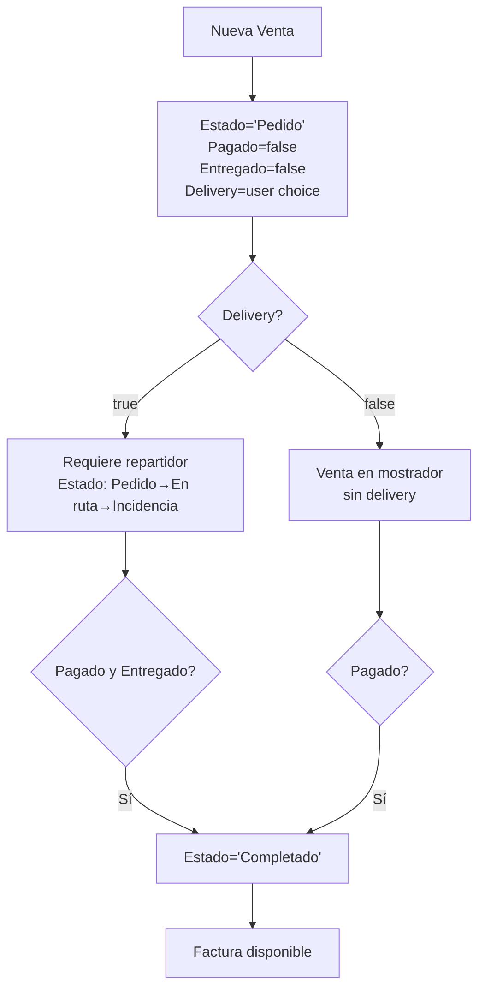

# Updated Plan: Venta Schema + Estado "Completado" + Nit + Delivery

Based on the final schema and user feedback, here is the complete list of changes:

## Schema (Final)

```sql
venta (
  id, fecha, hora, tipo, estado, porcentaje_descuento,
  repartidor_id, cliente_ci,
  pagado boolean DEFAULT false,
  entregado boolean DEFAULT false,
  nit character varying,         -- NEW: NIT at time of sale
  delivery boolean DEFAULT false -- NEW: true = needs delivery
  -- NO direccion_entrega (dropped)
)
```

## Estado Values

`'Pedido'`, `'En ruta'`, `'Incidencia'`, **`'Completado'`** (NEW)

## Files to Modify

### 1. [`VentaModel.cs`](ProyectoIntegradorNet10/Models/VentaModel.cs)

- **Remove** `DireccionEntrega`
- **Add** `Nit` (string?)
- **Add** `Delivery` (bool)
- **Update** `Estado` comment to include `'Completado'`

### 2. [`VentasService.cs`](ProyectoIntegradorNet10/Services/VentasService.cs)

- **Remove** `direccion_entrega` from all SELECT/INSERT/UPDATE queries
- **Add** `nit` and `delivery` to all SELECT/INSERT/UPDATE queries
- **Update** `MapVenta`: column indices 12=nit, 13=delivery

### 3. [`VentasUC.xaml`](ProyectoIntegradorNet10/UserControls/VentasUC.xaml) (Form)

- **Remove** "Dirección de Entrega" TextBox
- **Add** "NIT" TextBox
- **Add** "Delivery" CheckBox (needs delivery?)
- **Add** `'Completado'` to Estado ComboBox

### 4. [`VentasUC.xaml.cs`](ProyectoIntegradorNet10/UserControls/VentasUC.xaml.cs)

- **Remove** all `DireccionEntrega` references
- **Add** `Nit` and `Delivery` in `PopulateForm` and `BtnGuardar_Click`
- **Update** `SetReadOnlyMode` for new controls

### 5. [`VentasPagosUC.xaml`](ProyectoIntegradorNet10/UserControls/VentasPagosUC.xaml)

- **Add** `'Completado'` to the Estado filter ComboBox

### 6. [`PagosUC.xaml.cs`](ProyectoIntegradorNet10/UserControls/PagosUC.xaml.cs)

- **Update** `UpdateVentaEstadoFromPagos`: when `Pagado=true` AND (`Entregado=true` OR `Delivery=false`), set `Estado='Completado'`
- **Update** `BtnMarcarPagado_Click`: after setting `Pagado=true`, also auto-set `Estado='Completado'` if `!Delivery`

## State Flow (Updated)



## SQL (Run on DB)

```sql
ALTER TABLE venta DROP COLUMN IF EXISTS direccion_entrega;
ALTER TABLE venta ADD COLUMN IF NOT EXISTS nit character varying;
ALTER TABLE venta ADD COLUMN IF NOT EXISTS delivery boolean NOT NULL DEFAULT false;
```
